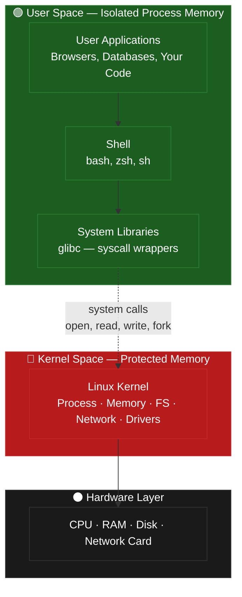
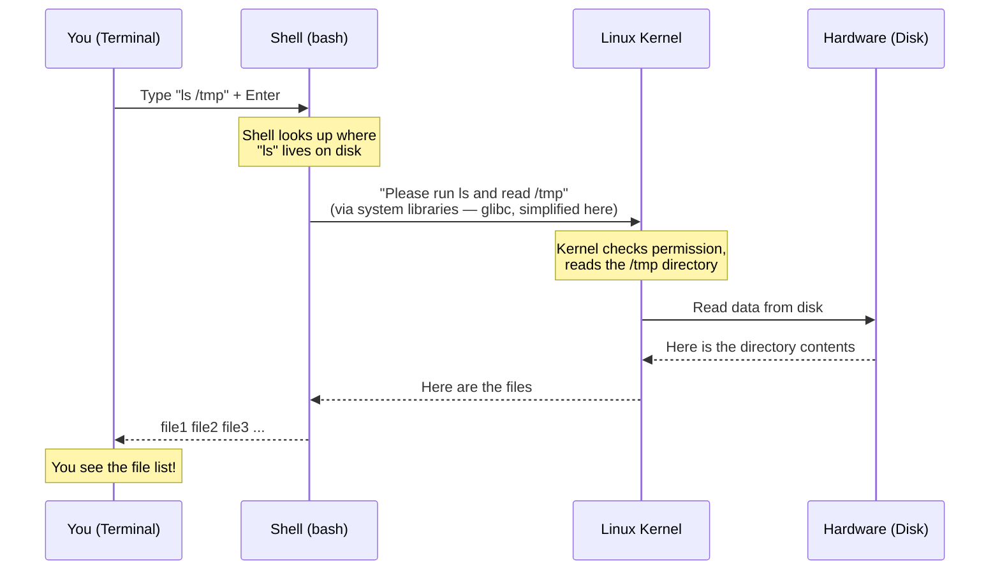

# Chapter 1: The Linux Foundation & Linux Architecture

> **Learning goal:** Understand who created Linux, why it rules the cloud, and how the layered architecture (hardware → kernel → libraries → shell → apps) helps you know **which layer** any production issue lives in — before you touch a single command.

---

## Before You Start — Get a Terminal

If you have never used Linux before, you need a terminal to follow along. Pick the option that fits your computer:

| Your Setup | What to Do |
|---|---|
| **Windows** | Open PowerShell as Administrator and run `wsl --install`. Restart when prompted. Then open the new "Ubuntu" app. That's your Linux terminal. |
| **Mac** | You already have a Unix terminal. Press `Cmd + Space`, type `Terminal`, press Enter. |
| **Chromebook** | Go to Settings → Linux (Beta) → Turn on. A terminal window will appear. |
| **No install? No problem** | Open [bellard.org/jslinux](https://bellard.org/jslinux/) in your browser. Click "Alpine Linux" — instant Linux terminal, nothing to install. |

> **One rule for today:** You will see a `$` symbol at the start of every line in the terminal. That is called the **prompt** — it means "I'm ready for your next command." Type the command, press **Enter**. That's it.

---

## Story (2 min)

> Linux has layers — like an onion. The kernel is at the centre; your apps are on the outside. In a moment you'll see the diagram. But first — let me tell you about a 2:47 AM disaster that taught me why this matters.

### The Kernel Panic

**Scene:** A startup's production server. 2:47 AM.

**Golu** (junior dev, always pressing buttons first): *"Jagu! The server is down! I restarted the app three times! Nothing!"*

**Jagu** (senior, has broken enough systems to know better): *(yawning)* *"Golu... did you check if it's even an app problem, or a kernel problem?"*

**Golu:** *"What's the difference? The website is down!"*

**Jagu:** *"That's like saying 'the car isn't moving' and pressing the accelerator harder. The engine might be dead, Golu. Not the gas pedal."*

Jagu types one command — `dmesg | tail -20` — and reads the kernel's own log. Two seconds later:

**Jagu:** *"Something crashed at the kernel level. No amount of app restarts would fix this. You just wasted 15 minutes restarting something that was never the problem."*

**Golu:** *"...So I should have called you first?"*

**Jagu:** *"No — learn the architecture. Then YOU become the person people call at 2 AM."*

> **The lesson:** Debug by the layer. Restarting the app when the kernel is broken is like rebooting your monitor because your computer froze.
>
> **The command that solved it:** `dmesg | tail -20` — reads the last 20 lines of the kernel's log. You will run this in the demo today. By the end of this lesson, you will know exactly what it does and why it was the right first move.

---

## 🏛️ Why Linux? — Context (3 min)

Now that you feel the pain — here is why Linux is worth learning.

### "Is Linux actually better, or just cheaper?"

It is both. But the real reason: **Linux is the only OS where you can look under the hood and fix things.** Windows shows you a blue screen. Linux shows you a log, a stack trace, and five ways to fix it.

**Linux powers:**
- **96%** of the cloud (AWS, Azure, GCP)
- **100%** of the top 500 supercomputers
- Most major stock exchanges
- Your WiFi router, your car's infotainment, your smart TV

### How did this start?

In **1991**, a 21-year-old Finnish student named **Linus Torvalds** posted on a newsgroup:

> *"I'm doing a (free) operating system (just a hobby, won't be big and professional like GNU)..."*

That "hobby" now runs the world. **The Linux Foundation** (founded in 2000) is the nonprofit that supports Linus and the thousands of engineers who maintain the kernel.

> **Quick distinction beginners always get wrong:**
> - **Linux** = the kernel (the engine)
> - **Ubuntu / Fedora / Debian** = a *distribution* — the full car built around that engine
>
> When someone says "I use Linux," they mean a distribution. The kernel is the same Linux in all of them.

---

## Real-world Problem (3 min)

### What Breaks Without Architecture Knowledge?

**Golu:** *"Okay, so what can actually go wrong if I don't know this?"*

**Jagu:** *"Oh, let me count the ways I've seen juniors suffer..."*

- **"The Infinite Restart Loop"** — The server is down. You restart the app. Still down. Restart again. Still down. Six restarts later you call your senior. They run one command and find a kernel error. No app restart in the world would have fixed that. You wasted 30 minutes because you didn't know which layer to check.

- **"The Mystery Error"** — Your program fails with a cryptic message. You Google the error for an hour. A senior glances at it and says "that's a kernel out-of-memory kill — nothing to do with your code." Without knowing the layers exist, you'd never know where to look.

- **"The Works-On-My-Machine Trap"** — Your code runs perfectly on your laptop. You put it on the server — it crashes. The difference? Your laptop runs Ubuntu 22.04, the server runs an older RHEL version with a different kernel. The code is identical. The layer underneath is different. You'd never catch this without knowing the architecture.

- **"The Slow App Trap"** — Your web app is slow. You rewrite the database queries, add indexes, optimise everything. Still slow. The real problem was the server was running out of memory and swapping to disk — a kernel resource issue, nothing to do with your code. Hours wasted optimising the wrong layer.

- **"The Interview Freeze"** — Someone asks: *"What is the difference between a kernel crash and an app crash?"* Blank. *"What is the difference between kernel space and user space?"* Blank. Both questions are answered by the onion model you will draw today. Architecture questions are standard in every DevOps and SRE interview. You cannot answer them by luck — but after this lesson, you can.

**The one-line truth:** *"Every production problem lives in a layer. Know the layers, find the problem faster."*

### Topic Flow — This Chapter's Journey

```
💥 Story → 🏛️ Context → ❓ Problem → 👁️ Visualization → 📖 Theory → ⌨️ Demo → ⚠️ Mistakes → 🎤 Interview → 📝 Assignment
```

---

## Visualization (2 min)

### The Onion Model — Your Mental Map

Draw this on a whiteboard. Better yet — draw it on a napkin. You'll need to recall it under pressure.

```
┌──────────────────────────────────────┐
│         User Applications            │  ← Browsers, databases, your code
│     (This is where 'the website'     │     Crashes here = just that app
│          goes down')                 │
├──────────────────────────────────────┤
│      Shell (bash, zsh, sh)           │  ← Command interpreter
│    (Where you type your 'magic')     │     Translates your commands
├──────────────────────────────────────┤
│    System Libraries (glibc)          │  ← System call wrappers
│   (The middle-man that never gets    │     You don't touch this usually
│         credit but does all          │
│          the real work)              │
├──────────────────────────────────────┤
│       Linux Kernel                   │  ← Process mgmt, memory, FS, net
│  (The 'strict HOD' who approves      │     Crashes here = 💀 kernel panic
│       every single request)          │
├──────────────────────────────────────┤
│        Hardware                      │  ← CPU, RAM, Disk, Network
│    (The physical stuff that          │     It either works or it doesn't
│       costs real money)              │
└──────────────────────────────────────┘
```

> **What is `glibc`?** It stands for GNU C Library — the standard library every Linux application uses to talk to the kernel. You will not interact with it directly as a beginner. Think of it as plumbing: it is always there, doing essential work, and you only notice it when something goes wrong.

### 🧠 Mermaid Architecture Diagram

This Mermaid diagram renders automatically on GitHub — use it as a quick visual reference:



> 🔄 **How to read this:** The arrows show the path every command takes. When you run a command, it travels: shell (bash) → system libraries → kernel → hardware. Applications sit above the shell and use the same path downward. The answer comes back the same way in reverse. Every layer talks only to the one directly below it — never skipping.

**Golu's Summary:** *"So the kernel is like that one manager who has to approve every single request, and if they rage-quit, the whole company shuts down?"*

**Jagu:** *"...That's... actually a perfect analogy. I'm stealing that for my next talk."*

**The Rule:** Each layer only talks to the layer directly below it. This boundary isn't bureaucracy — it's **security + stability**. A crash in user space? Just that app. A crash in the kernel? The whole system burns.

---

## Theory (5 min)

### Kernel Space vs User Space — The Great Divide

| Concept | Kernel Space | User Space |
|---------|-------------|------------|
| **Where** | The kernel's private kingdom | Where all apps live |
| **Memory** | Protected — apps can't touch it | Per-process isolation |
| **Hardware access** | Direct — drivers run here | Only via system calls (like asking permission) |
| **Crash impact** | 💀 Kernel panic — entire system dies | 🔥 Just that process dies |
| **How to inspect** | `dmesg`, `/proc` | app logs, `strace` *(Day 11)* |

### 🔄 What Happens When You Type a Command?

When you type `ls /tmp` and press Enter, it travels through every layer of the onion:



> **The big idea:** Even the simplest command — `ls` — touches every layer. Your input travels from the shell → kernel → hardware and the answer flows back up. The kernel is involved in *every single thing* you do on Linux.
>
> Later in the course (Day 11) you will use a tool called `strace` to watch every one of those trips in real time. For now, just remember: **layers exist, and every command crosses them.**

**Jagu's Real Talk:** *"I once watched a junior spend 2 hours debugging an 'app crash' — restarting, checking logs, rebuilding. Two hours. I walked over, ran `dmesg`, found a kernel-level error in 10 seconds. He looked at me like I was a wizard. I'm not a wizard. I just know which layer to check first."*

### systemd — The Notorious PID 1

systemd is the **first process** the kernel starts after boot. PID 1. Every other process is its descendant. If PID 1 dies, the kernel panics.

> *Think of systemd as the airport control tower. If the tower goes silent, every plane (process) is in trouble.*

```bash
ps -p 1                # Shows 'systemd' with PID 1
ps aux | head -20      # All running processes — every one is a child of PID 1
systemctl --version    # Which version of systemd? (systemctl = service manager, covered Day 6)
```

### Shell — Your Interpreter (Not Your Terminal)

The shell is a **user space program** that reads your commands and translates them into system calls. The terminal is just the window. The shell is the brain.

**For now, use `bash`.** It is the default on almost every Linux server in the world, and everything in this course is written for bash.

> **Which shell am I using?** Run `echo $SHELL` — it will tell you. If you see `/bin/bash`, you're set. If you see `/bin/zsh` (common on Mac), that's fine too — bash and zsh are nearly identical for everything in this course.

> **Curious about the other shells?** There are others — `zsh`, `sh`, `fish`. We will cover them on Day 20 (Shell Scripting) once you are comfortable with the basics. Don't switch now.

**Golu:** *"Wait, I've been saying 'I use bash' but I actually mean 'I use the terminal window with bash inside it'?"*

**Jagu:** *"Yes. And now you know the difference. You're already more dangerous than 50% of people calling themselves 'Linux administrators'."*

---

## Live Demo (15 min)

**Open your terminal. Run every command shown. Don't just watch — type. Muscle memory matters more than theory.**

> **Quick note on the `|` symbol:** You will see `|` (called a "pipe") in some commands below. It takes the output of one command and feeds it into the next. For example: `dmesg | tail -20` means "run dmesg, then show only the last 20 lines." We will cover pipes fully on Day 5. For now, just type them exactly as shown.

### Step 1 — Kernel Inspection

```bash
# Kernel version — first thing to check on ANY Linux system
uname -r                    # → e.g. 6.1.0-21-amd64  (just the version)
uname -a                    # → full info: kernel + hostname + date + architecture

# Kernel ring buffer — messages the kernel has logged since boot
# (The | tail -20 part means "show only the last 20 lines")
dmesg | tail -20
```

> **What is `dmesg`?** The kernel keeps a log of everything it does — hardware found at boot, errors, warnings. `dmesg` lets you read that log. Senior engineers check this first when a server misbehaves. Make it a reflex.

> **Ubuntu 22.04+ / WSL2 note:** If you see `dmesg: read kernel buffer failed: Operation not permitted`, run `sudo dmesg | tail -20` instead. Newer Ubuntu restricts kernel log access to root by default.

### Step 2 — Process Tree

```bash
# PID 1 — the very first process the kernel starts
# Every other process on the system is a descendant of this one
ps -p 1

# All processes running right now (| head -20 = show only first 20 lines)
ps aux | head -20

# Which shell are you using?
echo $SHELL                 # → /bin/bash or /bin/zsh
```

> **Optional:** If you want to see the full process family tree, install `pstree` first:
> `sudo apt install psmisc` (Ubuntu/Debian) — then run `pstree | head -20`

### Step 3 — /proc Virtual Filesystem (The Magic Window)

`/proc` is not a real folder on your hard drive. It is a live window the kernel creates in memory, so you can read kernel data using ordinary commands like `cat`. Nothing here is stored on disk.

```bash
# List what's inside /proc — shows the first 20 entries
# (the full list has 100+ items — numbers are process IDs, names are kernel data files)
ls /proc | head -20

# CPU info: how many cores? what model?
# (| head -20 = show only the first 20 lines — the full file is hundreds of lines long)
cat /proc/cpuinfo | head -20

# RAM info: how much memory does this system have?
cat /proc/meminfo | head -15

# How long has the system been running? (in seconds)
cat /proc/uptime
```

> **What are all those numbers in `/proc`?** Each number is a Process ID (PID). For every running process, the kernel creates a folder named after its PID inside `/proc`. Run `ls /proc` and then `ps aux | head -5` side by side — you'll spot the same numbers in both.

> **One important warning:** `/proc` looks like a folder, but it is NOT. Never try to delete anything inside it. On your personal VM the worst case is a reboot — but on a production server that would be a very bad day. Treat `/proc` as read-only.

### Step 4 — Walk the Onion from the Outside In

Now tie everything together. Run each command and notice which layer of the onion it belongs to:

```bash
# ── Running applications (outermost layer) ───────────────────
# What programs are running on this system right now?
ps aux | head -10

# ── Shell ────────────────────────────────────────────────────
# Which shell interpreter is translating your commands?
echo $SHELL          # → /bin/bash or /bin/zsh

# ── Kernel: version and uptime ───────────────────────────────
uname -r             # → e.g. 6.1.0-21-amd64  (your kernel version)
cat /proc/uptime     # → seconds since the system booted

# ── Kernel: live system data via /proc ───────────────────────
cat /proc/meminfo | head -5   # → how much RAM does this system have?

# ── Kernel: hardware event log ───────────────────────────────
dmesg | tail -20
```

> **What just happened?** Every single command crossed the user-space → kernel boundary. The kernel read from hardware memory, assembled the response, and handed it back to your shell. You can't do anything on Linux without the kernel getting involved — that is the entire point of the onion model.

**Note:** There is a powerful tool called `strace` that lets you watch every one of those kernel crossings in real time. We will use it on **Day 11** (Diagnosis & Troubleshooting) once you are comfortable with processes and the shell. Save that curiosity for then.

---

## Common Mistakes (5 min)

### ❌ Mistake 1: The Infinite App Restart

**The story:** A server goes down. The instinct is to restart the app — over and over. But if the problem is in the kernel layer, restarting the app does absolutely nothing. You're fixing the wrong layer.

```bash
# 😬 WRONG — Restarting the app when it's a kernel problem
# (systemctl is the command to start/stop services — you'll learn it on Day 6)
# sudo systemctl restart myapp  ← does nothing if the kernel is the issue

# ✅ RIGHT — Check the kernel layer FIRST, before touching the app
dmesg | tail -20
# Look for words like: error, panic, killed, oom (out of memory), failed
```

> **The rule:** When something breaks, ask yourself — *which layer is this in?* Kernel layer first (`dmesg`). App layer second (app logs). This single habit separates juniors from seniors.

### ❌ Mistake 2: Shell vs Terminal Confusion

```bash
# 😬 WRONG — 'I use bash' (No, you use a terminal that runs bash)
# Shell = the interpreter (bash, zsh)
# Terminal = the window app (gnome-terminal, iTerm2, VS Code terminal)

# ✅ RIGHT — Check what you're actually using
echo $SHELL    # → /bin/bash  (the interpreter — this is the shell)
echo $TERM     # → xterm-256color  (the display type — this is the terminal)
               # Note: on WSL2 or minimal server installs, $TERM may show
               # 'dumb' or nothing — that is normal. The shell is still set correctly.
```

### ❌ Mistake 3: The Windows Reflex

This is the #1 Day 1 mistake. Beginners carry Windows habits into Linux and get confused immediately.

```bash
# 😬 WRONG — Looking for .exe files, right-clicking, using Windows paths
# "Where do I download the installer?"
# "Why can't I find C:\Users\myname?"
# "Why did 'ls Desktop' say 'No such file'?"

# NOTE: 'ls' lists files in a folder — you'll learn it fully on Day 2.
# For now, just see the case-sensitivity in action:

# ✅ RIGHT — Linux is case-sensitive. These are TWO DIFFERENT things:
ls Desktop        # → works if a folder called "Desktop" (capital D) exists
ls desktop        # → "No such file or directory" (lowercase d = different folder)

# ✅ Your home folder is here — not C:\Users\
echo $HOME        # → /home/yourname  (not C:\Users\yourname)
ls $HOME          # → see what files are in your home folder
```

**The three Windows habits to unlearn on Day 1:**
- Linux has no `.exe` — software comes from a **package manager** (`apt install`, `yum install`)
- Paths use **forward slashes** (`/home/user`) not backslashes (`C:\Users`)
- **Everything is case-sensitive** — `File.txt` and `file.txt` are two different files

**Jagu:** *"I'm telling you this because I made ALL of these mistakes. And I have the server crash scars to prove it."*

---

## Interview Questions (5 min)

**Golu:** *"Okay, so what will they actually ask me in interviews?"*

**Jagu:** *"These five. Memorize the answers, but more importantly — understand them. Interviewers can smell memorization."*

1. **Q: What is the difference between Linux the kernel and a Linux distribution?**
   **A:** Linux is the kernel — the core software that manages hardware, memory, and processes. A distribution (Ubuntu, Fedora, Debian, RHEL) is a complete operating system built *around* the kernel: it bundles the kernel with a package manager, desktop environment, and tools. When someone says "I use Linux," they mean a distribution. Every distribution shares the same Linux kernel underneath.

   > *This is the most common entry-level DevOps interview trap. Get it right and you stand out immediately.*

2. **Q: What is the difference between kernel space and user space?**
   **A:** Kernel space is protected memory where the Linux kernel runs with full hardware access. User space is where all processes run in isolated memory. User space accesses hardware via system calls — a controlled gateway. A kernel space crash causes a kernel panic (💀 entire system fails); a user space crash only kills that process.

3. **Q: Why is systemd PID 1?**
   **A:** systemd is the first process started by the kernel after boot — it always gets PID 1. Every other process is a descendant. If PID 1 dies, the kernel panics. systemd manages service lifecycle, dependencies, and shutdown signals.

4. **Q: What is a system call? Give an example.**
   **A:** A system call is the mechanism user space programs use to request services from the kernel. Examples: `open()` to open a file, `fork()` to create a new process, `read()` to read data. You do not call these directly as a beginner — your shell and programs handle them for you. (On Day 11 you will use `strace` to watch them live.)

5. **Q: What is the /proc filesystem?**
   **A:** /proc is a virtual filesystem that does not exist on disk — it is created in memory by the kernel at runtime. It provides a live window into kernel state: CPU info, memory usage, per-process details. Tools like `top`, `ps`, and `free` all read from /proc internally.

---

## Assignment (10 min)

**Task: Linux Architecture Explorer**

**Golu:** *"Do this and you'll know more about your Linux system than most 'senior' engineers who've been 'working with Linux for 5 years.'"*

1. Run `ps -p 1` — what is PID 1 called on your system?
2. Run `uname -a` — write down your full kernel version string.
3. Run `cat /proc/cpuinfo | head -20` — look for two fields:
   - `model name` → that is your CPU model
   - `cpu cores` → that is how many cores your CPU has
4. Run `cat /proc/meminfo | head -5` — find the `MemTotal` line. What is the number? Divide by 1024 to get MB, divide by 1024 again to get GB.
5. Run `dmesg | tail -20` — look at the last 20 kernel messages. Do you see any words like `error`, `failed`, or `warning`?
6. Run `echo $HOME` — what is your home directory path?
7. **Draw the Linux onion model from memory.** 5 layers from inside out: Hardware → Kernel → Libraries → Shell → Applications. Next to each layer, write one command from today's demo that connects to it.
8. **YouTube challenge:** Post a photo of your hand-drawn onion model in the comments. Tell us your kernel version and how much RAM your system has.

**You know you're done when:** All 6 commands are run, you found your CPU model and RAM from `/proc`, and your onion diagram has a command written next to each layer.

---

## 🎬 For YouTube Viewers

**Comment prompt:** *"Type 'Onion 🧅' in the comments if you drew the diagram! And tell me — what was your kernel version? Did anything from `dmesg` surprise you?"*

---

## 🎯 Chapter Summary

| Item | |
|------|---|
| 🎯 **Takeaway** | Linux is a layered system. Knowing which layer a problem is in cuts debug time from hours to minutes. Kernel issues ≠ app issues. |
| ❓ **Interview Question** | What is the difference between Linux the kernel and a Linux distribution? |
| 📝 **Assignment** | Draw the onion model from memory, explore /proc, run dmesg |
| 🔥 **Challenge** | Draw the onion model on paper. Walk a friend through what each layer does and which command lives in it |
| 💥 **Today's Mistake** | Don't carry Windows habits into Linux. Case sensitivity, forward slashes, and package managers are non-negotiable. |
| ⚡ **Pro Tip** | In production incidents, start with `dmesg` and `/proc`. Kernel layer first, then app layer. Senior engineers know this instinctively. |

---

## 🧭 Now in Tech Terms

**Mapping the onion model analogy to exact commands:**

| Analogy | Tech Term | Command/Tool |
|---------|-----------|-------------|
| "The engine" | Kernel space | `uname -r`, `dmesg`, `/proc/cpuinfo` |
| "The driver" | User space & apps | `ps aux`, `systemctl status`, app logs |
| "The bridge" | System calls | `strace` *(covered Day 11)* |
| "The control tower" | systemd (PID 1) | `ps -p 1`, `systemctl` *(Day 6)*, `journalctl` *(Day 6)* |
| "The window" | /proc virtual filesystem | `cat /proc/cpuinfo`, `/proc/meminfo`, `/proc/uptime` |
| "The steering wheel" | Shell (bash, zsh) | `echo $SHELL`, `echo $TERM` |

---

## ✅ Concept Check (Micro-Assessment)

Test yourself before moving on:

1. **Which command reads the kernel's own log to check for problems?**
   - a) `systemctl status`
   - b) `dmesg | tail -20`
   - c) `ps aux | head -20`
   - d) `cat /var/log/syslog`
   - → **(b)** — `dmesg` reads the kernel ring buffer directly. Scan the output for words like `error`, `failed`, `killed`, or `oom`. On Day 5 you will learn `grep` to filter this automatically.

2. **What happens if systemd (PID 1) crashes?**
   - a) Only system services stop — a new PID 1 is spawned
   - b) The kernel automatically restarts it — no visible impact
   - c) **Kernel panic** — the entire system crashes because there's no process supervisor
   - d) systemd restarts itself — it's designed to self-heal
   - → **(c)** — systemd is PID 1, the root of the process tree. If it dies, the kernel has nothing left to run and panics.

3. **True or False: /proc is a real filesystem stored on disk.**
   - → **False.** /proc is a **virtual filesystem** created by the kernel in memory at runtime. It does not exist on disk. If you shut down the system, everything in `/proc` disappears — and the kernel recreates it fresh on every boot.

---

## 🔗 Where This Leads

This lesson is the foundation for everything that follows. Here is what comes next:

- **→ Day 02 (Essential Commands):** Now that you understand the layers, every command you learn will make more sense. `ps` reads from `/proc`. Every command you type crosses the kernel boundary.
- **→ Day 06 (Boot & Init):** The boot sequence — UEFI → GRUB → kernel → systemd — traces through the exact layers you drew today. You will watch the system build itself from hardware up.
- **→ Day 07 (Processes):** Process lifecycle, signals, and zombies are all kernel-managed. The onion model tells you *which layer* to look in when a process misbehaves.
- **→ Day 11 (Diagnosis & Troubleshooting):** `strace`, `lsof`, `ss` — the production debugging toolkit. All of them work by observing the user-space → kernel boundary you learned today. This is where the onion model becomes a real debugger's weapon.

<details>
<summary>Further down the road — how this connects to the rest of the course</summary>

- **→ Day 12 (Namespaces & cgroups):** Containers are NOT VMs. They are Linux processes with kernel features (namespaces + cgroups) that create isolation. The architecture you learned today is directly what makes Docker possible.
- **→ M04 (Containers):** Docker images run as processes on the same kernel. The onion model explains why all containers on a host share the kernel — and why a kernel exploit breaks all of them.
- **→ M06 (Kubernetes):** Pods are groups of containers sharing a kernel namespace. The architecture you drew today is the foundation of the entire cloud-native ecosystem.
- **→ M05 (Infrastructure as Code):** Terraform provisions cloud resources that run on the Linux kernel. Knowing the layers helps you identify whether a provisioning failure is a kernel issue or a config issue.
- **→ M15-M16 (AI-Assisted Ops):** When AI agents diagnose production issues, they use the same mental model — kernel layer first (`dmesg`, `/proc`), then user space. The onion model becomes the AI's diagnostic framework.

</details>

> *"The onion model you drew today is the single most reusable mental model in this entire course. Every production issue, every architecture decision, every debugging session — start with: which layer is this problem in?"* — Jagu
